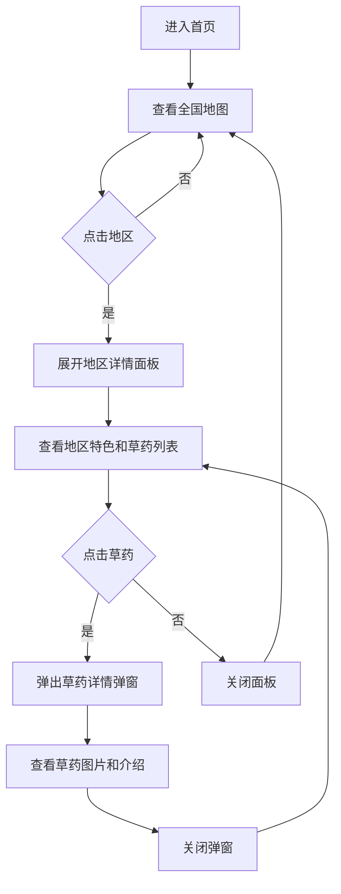

## 1. Product Overview
瑶医分布交互式地图是一个以地图为载体，展示瑶族传统医学及其草药资源的探索性应用。用户可以通过逐层展开的方式，从全国分布开始，深入了解各地区的瑶医特色和草药资源。

## 2. Core Features

### 2.1 User Roles
| Role | Registration Method | Core Permissions |
|------|---------------------|------------------|
| Normal User | No registration required | Browse map, explore regions and herbs |

### 2.2 Feature Module
1. **全国地图首页**: 展示瑶医主要分布区域，支持点击交互
2. **地区详情面板**: 展示选中地区的特色介绍和草药列表
3. **草药详情弹窗**: 展示草药图片、名称、功效等详细信息

### 2.3 Page Details
| Page Name | Module Name | Feature description |
|-----------|-------------|---------------------|
| 全国地图首页 | 中国地图 | 交互式SVG地图，高亮瑶医分布区域，支持缩放和平移 |
| 全国地图首页 | 图例说明 | 展示分布密度图例，帮助用户理解地图颜色含义 |
| 地区详情面板 | 地区介绍 | 展示地区名称、地理位置、瑶医特色概述 |
| 地区详情面板 | 草药列表 | 展示该地区种植的草药卡片，支持点击查看详情 |
| 草药详情弹窗 | 草药图片 | 展示草药高清图片 |
| 草药详情弹窗 | 草药信息 | 展示草药名称、学名、性味归经、功效主治等 |

## 3. Core Process
用户进入首页后看到中国地图，地图上高亮显示瑶医分布区域。点击某个区域后，右侧滑出该地区的详情面板，展示地区特色和草药列表。点击草药卡片，弹出草药详情弹窗，展示草药图片和详细信息。用户可以关闭弹窗返回草药列表，或关闭面板返回全国地图。

## 4. User Interface Design

### 4.1 Design Style
- **Primary Color**: 深绿色系 (#1a5c32, #2d7d46)，体现自然、草药、健康的主题
- **Secondary Color**: 暖橙色 (#e67e22)，作为强调色用于交互元素
- **Button Style**: 圆角矩形，悬停时有轻微缩放和阴影效果
- **Font**: 使用"Noto Serif SC"作为标题字体，"Noto Sans SC"作为正文字体
- **Layout**: 左侧地图+右侧面板的布局，草药详情采用居中弹窗
- **Icon**: 使用lucide-react图标库，风格简洁现代

### 4.2 Page Design Overview
| Page Name | Module Name | UI Elements |
|-----------|-------------|-------------|
| 全国地图首页 | 顶部导航 | Logo、标题、搜索框 |
| 全国地图首页 | 中国地图 | SVG交互式地图，hover高亮，click展开 |
| 全国地图首页 | 图例说明 | 颜色渐变条，分布密度说明 |
| 地区详情面板 | 头部区域 | 地区名称、标签、关闭按钮 |
| 地区详情面板 | 地区介绍 | 地理位置、瑶医特色描述 |
| 地区详情面板 | 草药列表 | 草药卡片网格，包含图片缩略图和名称 |
| 草药详情弹窗 | 弹窗遮罩 | 半透明黑色背景 |
| 草药详情弹窗 | 草药图片 | 居中大图展示 |
| 草药详情弹窗 | 草药信息 | 分类标签、功效描述、用法用量 |

### 4.3 Responsiveness
- **Desktop**: 左侧地图(70%) + 右侧面板(30%)布局
- **Tablet**: 地图全屏，面板底部滑出
- **Mobile**: 地图全屏，面板右侧滑出，草药弹窗适配屏幕宽度

### 4.4 Animation Effects
- 地图区域hover时放大并添加发光效果
- 地区面板滑入动画（从右侧）
- 草药列表卡片逐个淡入效果
- 草药弹窗淡入缩放效果
