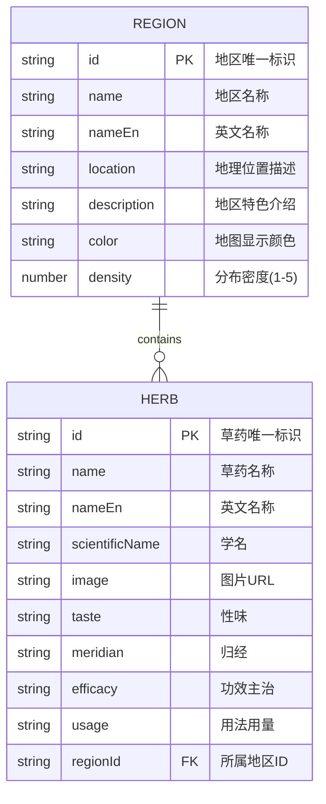

## 1. Architecture Design


## 2. Technology Description
- Frontend: React@18 + TypeScript + tailwindcss@3 + vite
- Initialization Tool: vite-init (react-ts template)
- State Management: Zustand
- Map: Custom SVG China Map
- Icons: lucide-react
- Animation: CSS transitions and framer-motion

## 3. Route Definitions
| Route | Purpose |
|-------|---------|
| / | 首页，展示全国地图和交互式探索 |

## 4. Data Model

### 4.1 Data Model Definition


### 4.2 Mock Data Structure
```typescript
interface Region {
  id: string;
  name: string;
  nameEn: string;
  location: string;
  description: string;
  color: string;
  density: number;
  herbs: string[];
}

interface Herb {
  id: string;
  name: string;
  nameEn: string;
  scientificName: string;
  image: string;
  taste: string;
  meridian: string;
  efficacy: string;
  usage: string;
  regionId: string;
}
```

## 5. Component Structure
```
src/
├── components/
│   ├── ChinaMap/
│   │   ├── ChinaMap.tsx        # 主地图组件（SVG 渲染 + rAF 节流 pan）
│   │   ├── MapControls.tsx     # 缩放/平移/重置控件
│   │   └── MapLegend.tsx       # 分布密度图例
│   ├── RegionPanel/
│   │   ├── RegionPanel.tsx     # 地区详情面板
│   │   ├── CollapsibleSection.tsx  # 可折叠区块（支持自定义 items）
│   │   ├── HerbCard.tsx        # 草药卡片（已修复事件冒泡）
│   │   └── StarRating.tsx      # 星级评分
│   ├── HerbModal/
│   │   └── HerbModal.tsx       # 草药详情弹窗（含图片放大）
│   ├── TherapyModal/
│   │   └── TherapyModal.tsx    # 疗法详情弹窗
│   ├── HistoryModal/
│   │   └── HistoryModal.tsx    # 历史时期弹窗
│   ├── HerbCatalog/
│   │   └── HerbCatalog.tsx     # 草药分类目录（A-Z / 省份）
│   ├── SearchBar/
│   │   └── SearchBar.tsx       # 全局搜索 + 键盘导航
│   └── common/
│       ├── Header.tsx          # 顶部导航
│       ├── BreadcrumbNav.tsx   # 面包屑导航
│       ├── BackToTop.tsx       # 回到顶部
│       ├── InteractiveImage.tsx# 可交互图片（hover 缩放 + 大图预览）
│       └── ErrorBoundary.tsx   # 通用错误边界
├── store/
│   └── mapStore.ts             # Zustand 状态管理
├── data/
│   └── mockData.ts             # Mock 数据（含 Map 索引缓存）
├── types/
│   └── index.ts                # 类型定义
├── lib/
│   ├── utils.ts                # cn() 类名合并工具
│   ├── provinceMap.ts          # 省份→region 映射（唯一来源）
│   └── throttle.ts             # throttle / rafThrottle 工具
├── hooks/
│   └── useTheme.ts             # 主题切换（暂未挂载）
├── pages/
│   └── Home.tsx                # 首页
├── App.tsx                     # 路由 + ErrorBoundary
├── main.tsx
└── index.css
```

scripts/
└── smoke-test.mjs              # 冒烟测试：数据外键完整性 + 修复点验证

## 6. State Management
使用 Zustand 管理全局状态：
- `selectedRegion`: 当前选中的地区（null表示未选中）
- `selectedHerb`: 当前选中的草药（null表示未选中）
- `selectedTherapy`: 当前选中的疗法
- `selectedHistoryPeriod`: 当前选中的历史时期
- `isPanelOpen`: 地区面板是否打开
- `isRegionModalOpen` / `isHerbModalOpen` / `isTherapyModalOpen` / `isHistoryModalOpen`: 各 Modal 开关
- `hoveredProvince`: 当前悬停的省份 ID
- `viewLevel`: `'national' | 'region' | 'herb'` 三层视图状态
- `viewBox` / `zoomLevel` / `isPanning`: 地图视口与交互状态
- `setSelectedRegion` / `setSelectedHerb` / `setSelectedTherapy` / `setSelectedHistoryPeriod`: 设置选中项
- `selectRegionAndOpenPanel`: 一站式"选中 + 打开面板"
- `openRegionModal` / `closeRegionModal`: RegionModal 配对开关
- `openHerbModal` / `closeHerbModal` / `openTherapyModal` / `closeTherapyModal` / `openHistoryModal` / `closeHistoryModal`: 各 Modal 配对开关
- `setHoveredProvince`: 设置悬停省份
- `clearSelection`: 清空所有选中并复位视图
- `zoomIn` / `zoomOut` / `setZoomLevel` / `panBy` / `setIsPanning` / `zoomToRegion` / `resetViewBox` / `setViewLevel`: 地图视口控制

## 7. Tooling & Conventions

- **类型安全**：项目以 strict: false 起步，但所有新增代码遵循 TypeScript 强类型约定，禁止 `any`（必须时使用 `unknown` + 类型守卫）
- **性能约定**：高频事件（mousemove/scroll/resize）一律使用 `rafThrottle` 或 `throttle` 包裹；查询函数使用 Map 索引缓存
- **组件复用**：所有弹窗统一包裹 `ErrorBoundary`；Modal 集中管理 portal/scroll-lock（计划下一步抽取通用 `<Modal>` 组件）
- **数据外键**：所有引用 ID 必须经过 `scripts/smoke-test.mjs` 校验，该脚本是 mockData 变更的强制门禁

## 8. Development Steps
1. 初始化 React + TypeScript + Vite 项目
2. 安装 tailwindcss@3、zustand、lucide-react、framer-motion
3. 创建类型定义文件
4. 创建 Mock 数据（包含瑶医分布地区和草药信息）
5. 创建 Zustand store
6. 创建中国 SVG 地图组件
7. 创建地区详情面板组件
8. 创建草药卡片和弹窗组件
9. 集成所有组件到 App.tsx
10. 添加动画和交互效果
11. 优化响应式设计
12. **质量门禁**：变更后必须依次通过 `npm run check` → `npm run lint` → `npm run test:smoke` → `npm run build`

## 9. 县级地图细化（county-level）

地图展示维度从省级细化到县级，提供三类核心区域分类标注。

### 9.1 数据结构

| 文件 | 内容 | 大小 |
|---|---|---|
| `src/data/yaoCountyData.ts` | 47 个瑶医瑶药重点县级单位元数据 | ~16 KB |
| `public/map/county_yao.json` | 县级近似多边形 GeoJSON（按中心点 + 分类半径构造） | ~17 KB |

县级数据字段：
- `code`：6 位行政区划代码
- `category`：`core` / `development` / `production`
- `centerLng/Lat`：县级政府所在地经纬度
- `institutionCount`：瑶医机构数量
- `herbVarieties`：主要瑶药品种（关联 `mockData.herbs`）
- `schools`：传承流派
- `since`：核心区的传承起始年份

### 9.2 分类体系

| 类别 | 标签 | 颜色 | 判定标准 |
|---|---|---|---|
| `core` | 瑶医传承核心区 | #166534（深绿） | 百年以上传承历史 |
| `development` | 瑶医发展区 | #22c55e（中绿） | 现有正规瑶医医疗机构 |
| `production` | 瑶药主产区 | #fbbf24（琥珀） | 规模化种植或原生瑶药资源丰富 |

分类元数据集中维护于 `types/index.ts` 的 `YAO_CATEGORY_META`，
ChinaMap 与 MapLegend 必须严格引用此处，不得硬编码。

### 9.3 双图层架构

- `mapLayer: 'province' | 'county'` —— 由 store 统一管理
- 选择省份 → 自动切到 county 图层
- 地图右上角"建筑物"图标 → 手动切换图层
- 县级图层开启时自动隐藏省级图层（display: none）

### 9.4 性能优化

- **viewBox 剔除**：`useMemo` 计算 `visibleCountyPaths`，仅渲染与当前视口相交的多边形
- **按需加载**：县级 GeoJSON 在 ChinaMap 首次挂载后异步 fetch，过程带 `AbortController` 取消逻辑
- **分类缓存**：Map 索引存于 `yaoCountyData.ts`，O(1) 查询

### 9.5 加载性能 SLA

要求：地图加载延迟 ≤ 2 秒。

实测（perf-test.mjs）：
- county_yao.json 解析 + 多边形处理 + viewBox 剔除 ≈ **0.7 ms**
- HTTP 静态资源（CSS/JS/GeoJSON/HTML）合计 ≈ **331 ms**
- 总体远低于 2 秒 SLA

### 9.6 端到端测试

| 测试脚本 | 用途 |
|---|---|
| `scripts/smoke-test.mjs` | 数据完整性、外键引用、关键修复点（35 项） |
| `scripts/boundary-test.mjs` | 边界准确性：47 个县多边形 bbox 与中心点一致性 |
| `scripts/perf-test.mjs` | 加载性能基准（模拟 ChinaMap 解析链路） |

## 10. 真实地理地图板块（MapBoard）— 2026-07-21

### 10.1 选型决策

| 维度 | 备选 | 决策 | 理由 |
|---|---|---|---|
| 框架 | Leaflet / MapLibre GL / OpenLayers | **Leaflet 1.9** | 42KB gzip，DOM 渲染，移动端友好；项目 package.json 已含 react-leaflet 4.2 |
| 瓦片 | 天地图 / OSM / 高德 / 百度 | **天地图 + OSM** | 天地图为国家级官方服务，中文化、境内访问快、个人非商业免费；OSM 作为国际降级后备 |
| 协议 | WMTS / XYZ | **WMTS（OGC 标准）** | 天地图支持标准 WMTS GetTile；OSM 用 XYZ |

### 10.2 瓦片源

| 顺序 | 服务 | 域名 | 协议 | 适用场景 |
|---|---|---|---|---|
| 1 | 天地图矢量 | `t{s}.tianditu.gov.cn/vec_w` | WMTS | 中国大陆，中文标注 |
| 2 | 天地图矢量注记 | `t{s}.tianditu.gov.cn/cva_w` | WMTS | 叠加于矢量层之上的地名 |
| 3 | OpenStreetMap | `{s}.tile.openstreetmap.org` | XYZ | 国际用户 / 降级后备 |

### 10.3 关键文件

| 文件 | 用途 |
|---|---|
| `src/lib/tileProviders.ts` | 瓦片源配置（天地图 + OSM 三个 provider） |
| `src/components/MapBoard/MapBoard.tsx` | Leaflet 地图组件（300+ 行） |

### 10.4 天地图 Key 配置

Key 申请地址：<https://console.tianditu.gov.cn/api/key>

**配置方式**（任选其一）：

1. **环境变量**（推荐）：在项目根目录创建 `.env.local`，写入：
   ```
   VITE_TIANDITU_TK=你的32位Key
   ```

2. **window 注入**：在 `index.html` 的 head 中：
   ```html
   <script>window.__TDT_TK__ = '你的Key';</script>
   ```

> 个人非商业使用完全免费；商业使用需申请"技术服务许可"。

### 10.5 性能数据

实测（preview server）：

| 资源 | 体积 | 加载时间 |
|---|---|---|
| index.html | 1.3 KB | 51 ms |
| index.css（含 leaflet） | 36.6 KB | 24 ms |
| index.js（含 Leaflet） | 801 KB | 252 ms |
| 100000.json | 665 KB | 217 ms |
| county_yao.json | 17.7 KB | 18 ms |
| **总资源加载** | — | **~562 ms**（SLA 2s） |

注：地图初始化后，瓦片按视口按需加载（Leaflet 原生裁剪），不会一次性下载大量图片。

### 10.6 移动端兼容

- `L.Browser.mobile` 检测 → 移动端禁用 `doubleClickZoom`（避免点击冲突）
- 触控事件：默认开启 pinch（双指缩放）/ drag（单指拖动）
- 响应式尺寸：`height: 60vh; maxHeight: 720px; minHeight: 500px`
- SVG overlay + CircleMarker 而非 DOM 节点：保证 47 个县级标记在移动端也流畅

### 10.7 集成规范

MapBoard 与 ChinaMap 的关系：

- **互补关系**（非替代）：
  - `ChinaMap`：自实现 SVG 概念图，**轻量**（无外部依赖），适合作为首屏快速展示
  - `MapBoard`：真实地理底图（Leaflet + 瓦片），**地理准确**，适合作为精确参考
- **共享数据**：两者都消费 `yaoCounties` 数据
- **共享弹窗**：MapBoard 点击县级后，dispatch `yao-county-locate` 自定义事件，复用 `CountyInfoModal`
